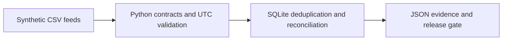

# Ops Data Reconciliation Lab

**A small, runnable example of turning messy operational data into a decision-ready release gate.**

This repository uses an invented service-ticket operation. A producer sends ticket activity events, a separate system publishes daily totals, and an ingestion service publishes its last successful heartbeat. The lab checks whether those three views agree before anyone relies on a dashboard or automated decision.

All names, records, and values are synthetic. The project contains no employer data, proprietary schemas, credentials, or production connections.

## What it demonstrates

- **Python:** input contracts, UTC normalization, evidence-rich exceptions, deterministic fixtures, and a command-line interface.
- **SQL:** window-function deduplication, aggregation by day/team, and reconciliation across missing keys in either source.
- **Operational judgment:** separate source validity, reconciliation, snapshot currency, and ingestion health; fail a strict gate when any high-severity condition is present.
- **Delivery discipline:** documented assumptions, explicit ownership and decisions, meaningful tests, and least-privilege CI.



The three inputs are `events.csv`, `daily_summary.csv`, and `ingestion_heartbeats.csv`. The source event grain is **one `event_id`**. Reported summaries are at **UTC day + team** grain. The heartbeat represents **last successful ingestion**, so a team with a quiet workload does not get called stale merely because it had no recent events.

## Run it

Requires Python 3.10 or newer. Runtime dependencies: Python standard library only.

```bash
python -m pip install -e .
python -m ops_recon demo --output-dir recon-output/demo
python -m ops_recon demo --clean --strict --output-dir recon-output/clean
python -m unittest discover -s tests -v
```

The first command after installation writes the three seeded CSV inputs and `report.json`. It prints a readable partition summary. The clean scenario passes the strict gate. To make the seeded failure block a job, run:

```bash
python -m ops_recon demo --strict --output-dir recon-output/demo
# Exit code 2 is expected because the intentionally bad fixture fails.
```

To supply CSVs yourself:

```bash
python -m ops_recon run \
  --events path/to/events.csv \
  --summaries path/to/daily_summary.csv \
  --heartbeats path/to/ingestion_heartbeats.csv \
  --as-of 2026-09-23T12:00:00Z \
  --freshness-minutes 120 \
  --output recon-output/report.json \
  --strict
```

`--as-of` fixes the evaluation clock. The bundled sample uses **2026-09-23 12:00 UTC** so the exact same result can be reproduced later. `--strict` exits `2` on any reported issue; input or schema errors exit `1`. Without `--strict`, reports are still written and the command exits `0` for exploration. The seed files and a full report are checked into [`examples/seeded`](examples/seeded).

## Sample result

| Indicator | Seeded fixture | Clean control |
| --- | ---: | ---: |
| Raw event rows | 11 | 9 |
| Excluded invalid rows | 1 | 0 |
| Excluded duplicate deliveries | 1 | 0 |
| Canonical events | 9 | 9 |
| Matching day/team partitions | 2 / 5 | 4 / 4 |
| High-severity issues | 7 | 0 |
| Gate | **FAIL** | **PASS** |

The seeded fixture tells a specific story: **North** has 4 actual events / 70 work minutes against 3 / 55 reported, and its summary was created before the latest event. **West** lacks a summary; **East** has a summary without source events; **Central** has a stale ingestion heartbeat. The invalid row and duplicate delivery are reported and excluded from totals. **South** matches. See the exact [`report.json`](examples/seeded/report.json).

## Data contract and controls

| Input | Required fields | Grain |
| --- | --- | --- |
| `events.csv` | `event_id`, `ticket_id`, `team`, `occurred_at`, `event_type`, `work_minutes` | One event delivery |
| `daily_summary.csv` | `day`, `team`, `event_count`, `work_minutes`, `generated_at` | One UTC day/team snapshot |
| `ingestion_heartbeats.csv` | `team`, `last_successful_ingestion_at` | One successful ingestion timestamp per team |

Timestamps require an ISO 8601 UTC offset. `day` is `YYYY-MM-DD`. Counts and work minutes must be nonnegative integers; recognized event types are `created`, `worked`, and `resolved`. An event after `--as-of` is rejected as future-dated. Rows failing validation are reported and excluded. If a valid event ID is delivered twice, SQL retains the first valid row for totals and emits a high-severity duplicate issue; it does not silently bless the duplicate. The same rule applies to duplicate summaries keyed by day/team. A missing or stale heartbeat is checked for every team represented by canonical events.

The sample is intentionally compact. Before using a similar pattern in production, specify a late-arrival window, source-of-truth contract, correction semantics, retention policy, exception routing, and exact release criteria. Those are tracked in the [decision and risk brief](docs/decision-and-risk-brief.md).

## Repository map

| Path | Purpose |
| --- | --- |
| [`src/ops_recon/reconcile.py`](src/ops_recon/reconcile.py) | Validate inputs and assemble evidence |
| [`src/ops_recon/reconciliation.sql`](src/ops_recon/reconciliation.sql) | Deduplicate, aggregate, and compare source versus summary |
| [`src/ops_recon/generator.py`](src/ops_recon/generator.py) | Produce reproducible synthetic fixtures |
| [`tests/test_reconcile.py`](tests/test_reconcile.py) | Assert arithmetic, exceptions, freshness, and strict exit behavior |
| [`docs/decision-and-risk-brief.md`](docs/decision-and-risk-brief.md) | Translate findings into owners, decisions, and controls |
| [`.github/workflows/ci.yml`](.github/workflows/ci.yml) | Run tests and a clean strict gate on changes |

This is an AI-assisted portfolio exercise with synthetic data, verified against the included behavior tests. It is not a deployed production pipeline or a claim about any organization's systems. The code is meant to be read, challenged, and improved alongside the decision and risk brief.
